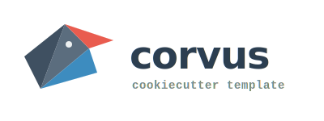

<p align="center">
  
</p>

# corvus �crow

[](https://github.com/crow-intelligence/corvus/actions)
[](https://github.com/crow-intelligence/corvus/blob/main/cookiecutter.json)
[](LICENSE)

A [cookiecutter](https://github.com/cookiecutter/cookiecutter) template for data-science, statistics, and text-analysis projects. Born as the internal template we use at [Crow Intelligence](https://crow-intelligence.github.io/) for day-to-day analytics, modelling, and NLP research — and now available for anyone to use.

---

## What you get

A project ready to work in, with no manual setup:

- **Python** at the version you choose, set via [pyenv](https://github.com/pyenv/pyenv)
- **[uv](https://docs.astral.sh/uv/)** as package manager with a locked `uv.lock`
- **[ruff](https://docs.astral.sh/ruff/)** for linting and formatting + **[ty](https://github.com/astral-sh/ty)** for type checking, both wired into pre-commit
- **[DVC](https://dvc.org/)** for data versioning with a GCS remote
- **[MLflow](https://mlflow.org/)** with local tracking and GCS artifact store (optional)
- **[structlog](https://www.structlog.org/)** for structured logging
- **[pydantic-settings](https://docs.pydantic.dev/latest/concepts/pydantic_settings/)** + **python-dotenv** for typed config and GCS credential management
- **Sphinx** docs scaffold (autodoc, napoleon, RTD theme)
- **Claude Code integration** — a per-project `CLAUDE.md` and pre-installed skill packs (see below)
- Sensible `.gitignore` and `.dvcignore` defaults
- A `Makefile` with `make help`, `make lint`, `make test`, `make dvc-push`, `make install-skills`, and more

### Project structure

```
my-project/
├── data/
│   ├── raw/          ← original, immutable data (DVC-tracked)
│   ├── processed/    ← transformed data (DVC-tracked)
│   └── external/
├── docs/             ← Sphinx docs
├── models/           ← serialised models and embeddings (DVC-tracked)
├── notebooks/        ← exploratory analysis
├── reports/figures/  ← generated graphics
└── src/my_project/   ← importable Python package
    ├── config.py     ← typed settings via pydantic-settings
    ├── logging.py    ← structlog setup
    └── tracking.py   ← MLflow helpers (if enabled)
```

---

## Quickstart

```bash
uvx cookiecutter https://github.com/crow-intelligence/corvus.git
```

Or, if you don't have `uv` installed:

```bash
pip install cookiecutter
cookiecutter https://github.com/crow-intelligence/corvus.git
```

Follow the prompts. When done, `cd` into your new project and:

```bash
cp .env.template .env   # fill in your GCP credentials
uv sync
uv run dvc pull         # once data exists on the remote
make help               # see all available commands
```

---

## Prompts

| Prompt | Default | Notes |
|--------|---------|-------|
| `project_name` | `my-project` | Slug and package name are derived automatically |
| `python_version` | `3.11` | Installed via pyenv if not present |
| `licence` | `MIT` | MIT, BSD 2/3, GPL/LGPL/AGPL v3, CC BY/BY-SA/BY-NC, Proprietary, Custom |
| `gcs_bucket` | `gs://my-bucket` | Used for DVC remote and MLflow artifacts |
| `gcp_project_id` | `my-gcp-project` | Required for GCS bucket operations |
| `gcs_region` | `EU` | Region for bucket creation |
| `use_mlflow` | `yes` | Adds MLflow and generates `tracking.py` |
| `mlflow_experiment` | project name | MLflow experiment name |
| `use_spacy` | `no` | Adds spaCy to runtime deps |
| `install_claude_skills_python` | `yes` | Vendor Matthew Honnibal's Python code-quality skills (MIT) |
| `install_claude_skills_analytics` | `yes` | Fetch nimrodfisher's 30 data-analytics skills at generation time |
| `install_claude_skills_anthropic` | `no` | Fetch Anthropic's official skill library (Apache-2.0) |

---

## Prerequisites

Before running corvus, you need:

- [pyenv](https://github.com/pyenv/pyenv) — Python version management
- [uv](https://docs.astral.sh/uv/) — package manager (`curl -LsSf https://astral.sh/uv/install.sh | sh`)
- [Google Cloud SDK](https://cloud.google.com/sdk/docs/install) — for DVC and MLflow on GCS (optional; you can configure GCS later)

---

## Using MLflow

Tracking store is local (`.mlruns/`, gitignored). Artifacts go to GCS.

```python
from my_project.tracking import init_experiment, start_run
import mlflow

init_experiment()

with start_run("feature-extraction"):
    mlflow.log_param("window_size", 5)
    mlflow.log_metric("coverage", 0.94)
    mlflow.log_artifact("reports/figures/vocab_growth.png")
```

View runs locally:

```bash
uv run mlflow ui
```

---

## Using DVC

```bash
# After adding new raw data:
uv run dvc add data/raw/corpus.jsonl
git add data/raw/corpus.jsonl.dvc data/raw/.gitignore
git commit -m "data: add raw corpus"
uv run dvc push

# On another machine:
uv run dvc pull
```

---

## Claude Code integration

Every generated project ships with:

- **`CLAUDE.md`** at the project root — per-project context (package name, Python version, layout, commands, MLflow/spaCy flags) that Claude Code loads automatically at session start.
- **`.claude/skills/`** — pre-installed skill packs that Claude Code discovers on open.

### Skill packs

| Pack | Source | Default | Licence |
|---|---|---|---|
| `python-quality` | [honnibal/claude-skills](https://github.com/honnibal/claude-skills) — vendored into this template | `yes` | MIT |
| `data-analytics` | [nimrodfisher/data-analytics-skills](https://github.com/nimrodfisher/data-analytics-skills) — fetched at generation | `yes` | unspecified upstream |
| `anthropic` | [anthropics/skills](https://github.com/anthropics/skills) — fetched at generation | `no` | Apache-2.0 |

Flip any of these off at cookiecutter time. To change your mind later, edit `.claude/skills/MANIFEST.yaml` in the generated project and run `make install-skills`.

### Scope

These skills are **project-scoped** — they live in the project's git repo and apply only when Claude Code is open in that project. For machine-wide skills, either symlink entries into `~/.claude/skills/` or install them there directly; project-level skills take precedence when both exist.

---

## About Crow Intelligence

[Crow Intelligence](https://crow-intelligence.github.io/) is an independent research
group and boutique consultancy specialising in language, cognition, and AI. We apply
computational methods to understand how language shapes thought — across historical
corpora, political discourse, financial narratives, and beyond.

Corvus is the template we use for every new project. We're sharing it because good
scaffolding shouldn't be reinvented each time.

---

## Contributing

PRs are welcome — see [CONTRIBUTING.md](CONTRIBUTING.md).
